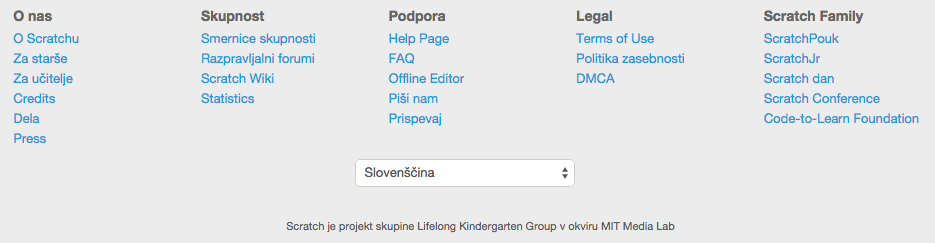
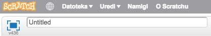

Uporaba Scratcha
================

Za izvajanje krožka potrebujemo računalnik za vsakega udeleženca in internetno povezavo. Obstaja sicer tudi aplikacija, ki omogoča programiranje brez internetne povezave, vendar v tem trenutku še ni na voljo v slovenskem jeziku in ni priporočljiva, ker želimo otrokom omogočiti, da svoje delo na teh učnih urah shranijo in urejajo tudi doma.

Najprej se prijavimo na [spletni strani Scratcha](http://scratch.mit.edu/).

Če privzeti jezik ni slovenski, ga nastavimo na dnu strani.

Pri vpisu sledite navodilom. Predlagamo, da si zapomnite otrokovo uporabniško ime in geslo, saj ju bo sicer hitro pozabil.

Sedaj lahko začnemo! Nov projekt usvarimo tako, da v levem zgornjem kotu kliknemo "Ustvari"

Projekte se splača poimenovati, da jih bomo kasneje lažje našli. To storimo tako, da spremenimo ime v levem gornjem kotu.

