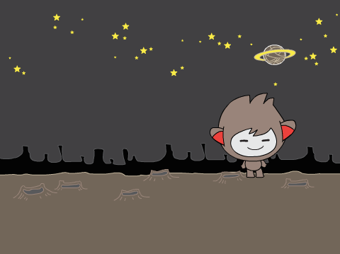

Zaporedje ukazov
================

Navodila za sestavljanje igračke iz čokoladnega jajčka, recept za najboljše piškote ali palašinke ...
vse to so primeri programov. Njihovo izvajanje poteka v nekem zaporedju: zaporedja priprave palačink ne moremo spremeniti tako, da najprej spečemo jajca in jih šele potem razbijemo. Tudi programerji napišejo program tako, da si ukazi sledijo v zaporedju in jih računalnik v takem vrstnem redu tudi izvaja.

Vesoljec na luni
----------------

**Naloga**: Vesoljec se sprehaja po luni. Najprej naj se premakne za nekaj korakov naprej. Nato naj nas pozdravi in reče: "Pozdrav z lune!" Potem naj nadaljuje svojo pot tako, da se ponovno sprehodi nekaj korakov naprej.

